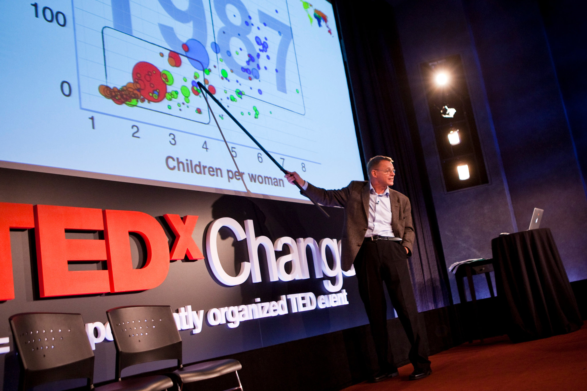

```{r Setup, include=FALSE}
knitr::opts_chunk$set(echo = TRUE)
```

## Package Overview

```{r GoogleVisPic, out.width= "50%", fig.align='center', fig.cap="GoogleVis Logo"}

```

The package was intended to act as an **interface between R and Google Charts**. The goal was to allow R users to take advantage and create interactive Google chart visualizations without having to upload their data to Google.

```{r HansPic, out.width= "50%", fig.align='center', fig.cap="Hans Rosling"}

```

In 2006, **Hans Rosling** gave an inspiring TED talk about social and economic developments, heavily utilizing data analytics. To better communicate his findings, he and coworkers at *Gapminder* created animated charts. This would popularize the idea or utilization of interactive charts. After *Gapminder* was bought by Google, the authors of the googleVis were inspired by Rosling’s talks and the desire to use interactive data visualization tools to foster the dialogue between data analysts and others. Thus, the googleVis package was born. 


