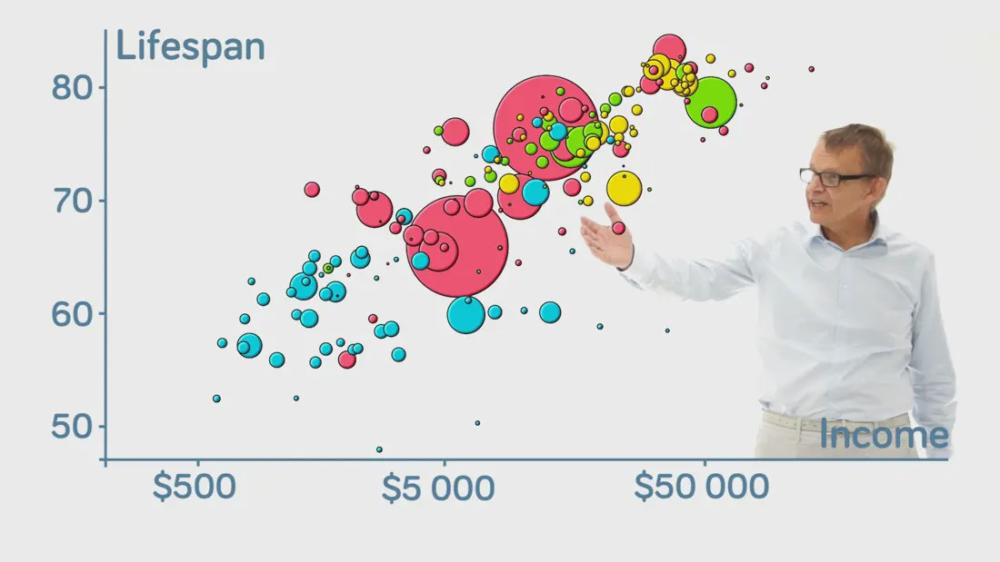

```{r Setup, include=FALSE}
knitr::opts_chunk$set(echo = FALSE, warning=FALSE, message=FALSE, error=FALSE)
```

```{r PackagesNeeded}
install.packages("prettydoc")
install.packages("tidyverse")
install.packages("knitr")
install.packages("datasets")
# install.packages("plyr")
# install.packages("googleVis") # Remove and place in another chunk later
library(prettydoc)
# library(plyr)
library(tidyverse)
library(knitr)
library(datasets)
# library(googleVis) # Remove and place in another chunk later
```


## Package Overview
```{r GoogleVisPic, out.width= "100%", fig.align='center', fig.cap="The Google Logo"}
knitr::include_graphics("Logo.png")
```

The package was intended to act as an **interface between R and Google Charts**. The goal was to allow R users to take advantage and create interactive Google chart visualizations without having to upload their data to Google.

### History of googleVis
```{r HansPic, out.width= "65%", fig.align='center', fig.cap="Hans Rosling at his TED talk"}
knitr::include_graphics("Hans.png")
```

In 2006, **Hans Rosling** gave an inspiring TED talk about social and economic developments, heavily utilizing data analytics. To better communicate his findings, he and his coworkers at *Gapminder* created animated charts. 

> The link to his TED talk *"Debunking Third-World Myths With The Best Stats You've Ever Seen"* can be found [here](https://www.ted.com/talks/hans_rosling_the_best_stats_you_ve_ever_seen).

<iframe width="560" height="315" src="https://www.youtube.com/watch?v=hVimVzgtD6w" frameborder="0" allowfullscreen></iframe>

This would popularize the idea or utilization of interactive charts. After *Gapminder* was bought by Google, the authors of the googleVis were inspired by Rosling’s talks and the desire to use interactive data visualization tools to foster the dialogue between data analysts and others. Thus, the googleVis package was born.

## Background Information
Some background on the googleVis package: the history of the package, what it allows users to do, and its dependencies. 

### Version History
Version history information on googleVis can be found in the [CRAN package archive](https://cran.r-project.org/src/contrib/Archive/googleVis/?C=N;O=A): 

Earliest Public Instance: **googleVis v0.2.1** (12/03/2010)

Most Current Instance: **googleVis v0.6.6** (07/08/2020)

### Usage 
Whenever the googleVis package is called from the library for the first time, the following warning message appears:

```{r LoadGoogleVis, message=TRUE, warning=TRUE}
install.packages("googleVis")
library(googleVis)
op <- options(gvis.plot.tag = "chart")
```

googleVis was intended to create interactive visualizations. Visualizations in the package are more efficiently produced than in base R. Contains non-traditional visual analysis aids such as those below:

- Gauge Charts
- Google Maps 
- Tree Maps
- Sankey Charts
- Calendar Charts
- Timeline Charts
- Motion Charts

... and more. All of these charts are interactive, allowing you to zoom in/zoom out, click on, and view individual data points/groups.

> While using googlevis, visualizations are initiated by ‘gvis’ + ChartType

An example of such code would be:
```{r ExampleCode, echo=TRUE, eval=FALSE}
# Gives linechart visual
gvisLineChart(df, 
              xvar="time", 
              yvar=c("Measure 1","Measure 2"),
              options=list()
              ) 
```

Had this been run, the output would be a Line Chart of its dataset. It would contain two lines (of measure 1 and measure 2) that would show changes over time. The *options=* argument allows for more precise customization to the theming and aesthetics of the plot. The plot would have been interactive and powered through Google engines.

An essential tool when creating visuals with the googleVis package is the official site for [Google Charts Documentation](https://developers.google.com/chart/interactive/docs). This site provides all the functions and commands to specify in order to create the visual the way you would like it. *It is important to keep in mind, however, that code is in a Javascript style so while the function names are the same, there are differences in some of the coding grammar*.

### Dependencies
- Requires R (>= v3.0.2)
- Requires internet connection (to connect to Google servers)
- Requires Flash Player (for Motion Charts)

Additionally, some R packages are suggested:

1. "devtools"
2. "RJSONIO"
3. "knitr"
4. "shiny"
5. "httpuv"

These complementary packages above may be needed to properly run some of the code and visuals in googleVis.

## Examples of Usage

### Geochart
Here we take advantage of the **gvisGeoChart()** function, along with the USArrests dataset included in base R, to create an interactive map of the United States that is colored by each state's murder rate. 

#### U.S Murder Rates by State
```{r Geochart, results='asis'}
# Use sample dataset on US crime rates from dataset package
USArrests <- USArrests
USArrests <- USArrests %>% 
  rownames_to_column()
names(USArrests)[names(USArrests) == "rowname"] <- "State"

# Create geochart of US states based on murder  
MurderMap <- gvisGeoChart(USArrests, 
             locationvar="State", 
             colorvar="Murder",
             options=list(region="US",
                          displayMode="regions",
                          resolution="provinces",
                          width=600, height=400,
                          colors="#FF0000")
             )
print(MurderMap, "chart")
```

Looking at the visual above, it can be seen that southern states tend to have the higher murder rates, with **Georgia** winning the honor of being the highest. Runner-ups include Florida, Mississippi, and Louisiana.

### Word Tree
When working with qualitative or categorical data, the function **gvisWordTree()** can allow a cursory visual of how often words or phrases can be found in a dataset (such as a written passage or the searches on webpage).   

#### Cats Phrase Word Tree
```{r WordTree,results='asis'}
# Use sample dataset Cats from googleVis
CatsDat <- Cats

# Must remove row with non-positive value (Sentiment == 0)
CatsDat <- CatsDat[-16,]

# Creates word tree based on Cats dataset
word_tree <- gvisWordTree(CatsDat, 
                          textvar = "Phrase", 
                          sizevar = "Sentiment", 
                          options = list(backgroundColor='#A569BD',
                                         height=700,
                                         colors='#000000')
                          )
print(word_tree, 'chart')
```

This is an example showing the word capabilities of googleVis word tree chart. In the plot above, a data frame of phrases are displayed with sizes varying depending on the number of times the word is utilized. The different branches lead to possible pathways in the phrasing, with branches splitting off to connect words used together. At the top, it can be seen one possible path has "cats" -> "are" -> "better than" -> "dogs", but another fork leads to "hamsters" or "kittens". 

### Timeline
Data taking place over time is best displayed with the Timeline plot and, in googleVis, can be called with the function **gvisTimeline()**. 

#### Timeline of the United States' Conflicts & Wars with Countries/Groups
```{r Timeline, results='asis'}
# Creates a dataset from scratch chronicling the conflicts/wars the US has been in
war_data_TL <- data.frame(Position=c(rep("Official War", 11), rep("Unofficial Conflict", 9)),
                          Name=c("Great Britain", "Mexico", "Spain",
                           "Germany", "Austria Hungary", "Japan", "Germany", "Italy", "Bulgaria", "Hungary", "Rumania", "Great Britain", "Confederacy", "North Korea", "China", "North Vietnam", "Iraq", "Taliban", "Iraq", "ISIS"),
                          start=as.Date(x= c("1812-06-07", "1846-05-12", 
                                          "1898-04-25", "1917-04-06", "1917-12-07", "1941-12-08", "1941-12-11", "1941-12-11", "1942-06-04","1942-06-04","1942-06-04", "1775-04-19", "1861-04-12", "1950-06-25", "1950-10-25", "1954-06-01", "1990-08-02", "2001-10-07", "2003-03-20", "2013-06-13")),
                          end=as.Date(x= c("1815-02-18", "1848-02-02", 
                                          "1898-12-10", "1918-11-11", "1918-11-11", "1945-09-02", "1945-09-02", "1945-09-02", "1945-09-02","1945-09-02","1945-09-02", "1783-09-03", "1865-04-09", "1953-07-27", "1953-07-27", "1975-04-29", "1991-02-28", "2020-10-04", "2011-12-18", "2020-10-04"))
                          )

# Creates a timeline of all the conflict/wars
Timeline <- gvisTimeline(data= war_data_TL, 
                         rowlabel="Position",
                         barlabel="Name",
                         start="start", 
                         end="end",
                         options=list(timeline="{groupByRowLabel:true}",
                                      backgroundColor='E8E8E8',
                                      width=1000,
                                      height=320,
                                      colors='#D70000')
                         )  
print(Timeline, 'chart')
```

Here we are shown a timeline of the countries that the United States has had official wars with, along with the duration and time period of those wars. This list also includes a separate section for the unofficial military actions, peacekeeping, insurrections, skirmishes, etc. (where a deceleration was not given). The data shows that the most recent war where the U.S. gave a formal deceleration was **WWII**, meanwhile the first formal war was the **War of 1812** with Britain. It also shows the longest conflict being the **Vietnam War**, going from 1954 until the 1975. 

### Gauge Chart
Another unique and unusual data visual, the Gauge chart allows for a numerical measure for multiple categories. googleVis contains a function called **gvisGauge()** that allows for such coding.

#### Class Grade Gauges
```{r Gauge, results='asis'}
# Create dataframe from scratch of student's class grades
class_grade <- data.frame(Name = c("Clancy", "Alyssa", "Barney", "Brian", "Dora", "Nancy"),
                          Grade = c(100, 52, 95, 82, 76, 88)
                          )

# Creates a gauge plot of the students and their grades
Gauge <-  gvisGauge(class_grade, 
                    options=list(min=0, max=100, 
                                 greenFrom=75, greenTo=100, 
                                 yellowFrom=60, yellowTo= 75,
                                 redFrom=0, redTo=60, 
                                 width=600, height=450)
                    )
print(Gauge, 'chart')
```

Above, a number of gauges show the class grades for six students, with each gauge representing an individual person. Here, Clancy is seen to be the student with the highest grade (100) in the class, while Alyssa has the lowest (52).  

### Calendar
When working with data over a period of many days, such as months or years, the Calendar plot shows daily fluctuations in a measure over the course of the year and can highlight long-term patterns that may not be seen otherwise. The function **gvisCalendar()** in googleVis allows for Calendar plots to be made.

#### Daily Pressure (mb) for Hurricane Andrew
```{r Calendar, results='asis'}
# Use the Andrew dataset from googleVis, tracking the hurricane Andrew
Andrew <- Andrew

# Create
calendar <- gvisCalendar(Andrew, 
                    datevar="Date/Time UTC", 
                    numvar="Pressure_mb",
                    options=list(
                      title="Daily Pressure for Hurricane Andrew",
                      height=200,
                      width=1100,
                      calendar="{yearLabel: { fontName: 'Times-Roman',
                               fontSize: 38, color: '#1A8763', bold: true},
                               cellSize: 18,
                               cellColor: { stroke: 'red', strokeOpacity: 0.2 },
                               focusedCellColor: {stroke:'red'}}")
)
print(calendar, 'chart')
```

In this particular calendar above, we see that the Hurricane Andrew was really only active for a period of a month - seen over the course of about two weeks in August 1992. We can observe that the day with the highest hurricane pressure was **August 20th** (Thursday), meanwhile the lowest hurricane pressure was on **August 23rd** (Sunday).  

### Bubble Chart
The Bubble Chart is best applied when there are multiple variables of interest that you wish to visualize all at once, without needing to switch to different graphs/plots. The bubbles can have a variable assigned to their size, their color, and the usual X and Y axes; this essentially means up to 4 variables can all be displayed at once on the graph. Additionally, the interactivity of all googleVis plots means that more information can be gleaned by hovering the cursor above the datapoint. The function **gvisBubbleChart()** creates such bubble plots in googleVis: 

#### Bubble Chart of Mammal Sleep Habits & Weight
```{r Bubble, results='asis'}
# Taking the msleep sample dataset from the ggplot2 package
MammalSleep <- msleep
MammalSleep <- MammalSleep[,-c(2,4,5)]
MammalSleep <- MammalSleep %>% 
  rename(`Animal`=name, `Total Sleep (hr)`=sleep_total, `REM Sleep (hr)`=sleep_rem, 
         `Sleep Cycle (hr)`=sleep_cycle, `Brain Weight (kg)`=brainwt, 
         `Body Weight (kg)`=bodywt, `Total Awake (hr)`=awake, `Vore`=vore) %>% 
  na.omit()

# Create the bubble chart using googleVis
BubblePlot <- gvisBubbleChart(MammalSleep, 
                              idvar="Animal",
                              xvar="Sleep Cycle (hr)", 
                              yvar="Total Sleep (hr)",
                              colorvar="REM Sleep (hr)", 
                              sizevar="Brain Weight (kg)",
                              options=list(height=400,
                                       width=1000,
                                       vAxes="[{title:'Total Sleep (hr)'}]", 
                                       hAxes= "[{title: 'Sleep Cycle Length (hr)'}]")
                          )
print(BubblePlot, 'chart')
```

The visual above shows the data of sleep habits and weights recorded in a number of mammals. On the X-axis is sleep cycles, the y-axis has the total sleep, the color represents the REM sleep, and the size of the bubbles is the Brain Weight. We can see that longer sleep cycles correspond with larger brain weight, while the amount of total sleep seem to have no relation with it. Interestingly, shorter sleep cycles (and smaller body weights) in mammals seem to relate to higher amounts of REM sleep. 

### Motion Chart
The motion chart shows an animated visual of a plot with moving data, this can be used to call attention to gradual change in the measures, or to simply make the presentation visuals more exciting and eye-catching. The function **gvisMotionChart()** is what allows for the display below:

#### Stores' Financial Motion Chart
```{r Motion, results='asis'}
# Create dataset from scratch to simulate 3 stores & their financials
MonthSeq <- as.Date(c('2020-01-01', '2020-02-01', '2020-03-01', '2020-04-01', '2020-05-01'))
Store <- c(rep('Store 1', 5), rep('Store 2', 5), rep('Store 3', 5))
Month <- rep(MonthSeq, 3)
Revenue <- c(72, 57, 60, 62, 46, 35, 33, 39, 46, 51, 65, 59, 70, 83, 92)
Costs <-   c(70, 45, 50, 43, 52, 30, 31, 33, 38, 38, 60, 57, 56, 72, 73)
Profit <-  c(02, 12, 10, 19, -6, 04, 02, 06, 08, 13, 05, 02, 14, 11, 19)
StoreDat <- data.frame(Store, Month, Revenue, Costs, Profit)

# Creates animated, interactive motion chart
Motion = gvisMotionChart(StoreDat, 
                       idvar="Store", 
                       timevar="Month",
                       options = list(width=950, height=700))
print(Motion, 'chart')
```

As we can see the motion chart is the most interactive, animated, customizable option. There are three tabs at the top right, one gives a bubble plot, the second shows a bar chart, and the third displays a line graph. All three are animated and can be made to move over time by pressing the play button at the bottom left. The X and Y axes can be switched to any variable in the dataset, the colors and sizes of the plots can also be assigned variables. This allows for a truly extensive customization of the visual.

### Merging Multiple Plots
Suppose we wished to display more than a single type of visual or plot all together in a group. There are times when the same dataset can be examined differently using multiple visualizations. The googleVis package allows this with the function **gvisMerge()**, which allows a joining of multiple googleVis plots that have been created previously. Here we will examine the same dataset below using multiple types of visuals all at once with the merge function:

#### Merged Population Visuals (as of October 09, 2010)
```{r Merge, results='asis'}
# Use the googleVis sample dataset called Population
PopInfo <- Population %>% 
  select(Rank, Country, Population, "% of World Population", Flag)
PopTruncated <- head(PopInfo, 10)

# Create three types of googleVis plots and assign them to a variable
A <- gvisGeoChart(PopInfo, 
             locationvar="Country", 
             colorvar="Population",
             options=list(width=400, height=225))
B <- gvisBarChart(PopTruncated[,2:3], options=list(width=400, height=225))
C <- gvisTable(PopInfo, 
                      formats=list(Population="#,###",
                                   '% of World Population'='#.#%'),
                      options=list(page='enable',
                                   width=500,
                                   height=450))

# Use the merge function to create one graphic that displays all three at once
ABC <- gvisMerge(gvisMerge(A, B, horizontal = FALSE), C, horizontal = TRUE, 
    tableOptions = "cellspacing=5")
print(ABC, "chart")
```

Looking above, we have three different visuals all examining the same googleVis dataset of the world population by country. We can see in the upper left corner there is an interactive world map, colored by country population. The map is interactive so we can move the cursor on the countries and get specific values for the population. In the lower left corner is a bar chart, showing the top 10 countries by population. We can see that **China** and **India** are by-far the leaders, each with populations above a billion; following distantly behind is the United States, Indonesia, and Brazil. Finally, taking up the entire right side is a chart of the countries. Thanks to the merge function, these three plots can be taken all together to provide a comprehensive, interactive delve into this dataset. 


## Similar Packages

### ggplot2
```{r GgplotPic, out.width= "50%", fig.align='center', fig.cap="ggplot2 Logo"}
knitr::include_graphics("ggplot.png")
```

ggplot2 is a package that is part of the increasingly ubiquitous *tidyverse* collection, focused primarily on a sequential layering approach to creating graphics that allows minute customization of the visuals. While ggplot2 exists as an upgrade entirely within R, googleVis runs through Google engines and must be displayed as a HTML item to function.    

> More about the ggplot2 package can be found at the tidyverse site [here](https://ggplot2.tidyverse.org/).

This package is similar to googleVis, with both mostly used to create graphs for visualizing data. In both packages there are ways to make basic visuals - bar graphs, line graphs, box plots, and scatterplots, among others. However, googleVis contains a number of eclectic graphs and visuals uncommon in other graphic packages; its functions allow for the creation of animated Motion Graphs (gvisMotion), Word Trees (gvis), and Google maps (gvisMap) - all quite different from anything found in ggplot2.

```{r GgplotExample}
# Create Example dataframe to use
CarPurchase <- data_frame(`Vehicle Type` = c("Minivan", "Sedan", "Pickup Truck", "Hatchback", "Convertable"), `Purchase Count` =  c(38, 124, 52, 89, 13))

# Bring in ggplot2
library(ggplot2)

# Create ggplot bar chart from the example dataset
ggplot(data = CarPurchase, aes(x=`Vehicle Type`, y=`Purchase Count`)) +
  geom_bar(stat="identity", fill = "darkred") + 
  labs(title = "Dealership Purchases", x = "Vehicle Type", y = "Purchase Count (past week)") +
  geom_text(aes(label=`Purchase Count`), vjust=1.6, color="white", size=3.5) + 
  theme_grey()

```

The bar chart above shows just a small sample of what the ggplot2 package can do. A simulated dataset of vehicle purchases at a dealership over the week was emulated. With a modular, recursive system that allows a sequential layering approach, the user can essentially act as a painter adding each successive part to the graph. 

### animation

The animation package contains tools that allow for the animated motion of statistic visuals and graphs. A benefit of the animation package over googleVis is its flexibility in export options to other formats - it can be shown using HTML, embedded in Adobe PDFs, converted into a GIF, or turned into a mp4 video. 

> More about the animation package can be found at the site [here](https://cran.r-project.org/web/packages/animation/animation.pdf).

The animation package is most similar to the Motion Chart in googleVis (gvisMotion), both create short looping animated visuals. However, as a package entirely devoted to animation, the animation package provides far more options and "customizability" in animating. Meanwhile, the majority of the functions in googleVis are devoted to interactive (but still) graphs. Again, the reliance on third-party engines hurts googleVis, as the animation package can exist solely using R framework. 

```{r AnimationExample, fig.show='animate'}
# Bring in animation package
install.packages("animation")
library(animation)
# library(gifski)

# Creates Rosling Bubble animation for animated bubble plots
ani.options(interval = 0.1, nmax = 50)
animated <- Rosling.bubbles()
```

The animation package actually allows users to recreate the bubbles famously used by Hans Rosling in his seminal TED talk mentioned earlier. A bubble plot, ideal to show trends in data over time, is shown above with random data as an example of what the animation package can be utilized to do. The actual bubble plots used by Hans are shown for comparison below:

```{r AnimationPic, out.width= "80%", fig.align='center', fig.cap="The original Rosling Bubble Plot"}

```


### rCharts
```{r RchartsPic, out.width= "50%", fig.align='center', fig.cap="rCharts Logo"}

```

Like googleVis, rCharts is a package intended to create interactive visualizations for data. Another similarity is how both require third-party engines to function, with googleVis needing Google and rCharts requiring Java. There are multiple javascript charting libraries supported within the rCharts package that can be utilized for visuals in R; this includes Polychart, MorrisJS, NVD3, xCharts, HighCharts, Leaflet, etc. Many of the types of plots the packages create are similar - including scatterplots, bar charts, heat maps, and even a geographic map function (gvisMap in googleVis, leaflet in rCharts). 

> More about the rCharts package can be found at rCharts site [here](https://ramnathv.github.io/rCharts/).

```{r rChartsExample, results='asis', eval=FALSE, echo=TRUE}
# Bring in the rCharts package
install.packages("devtools")
library(devtools)
install_github('ramnathv/rCharts', force = T)
library(rCharts)
options(RCHART_WIDTH = 600, RCHART_HEIGHT = 400)

# Creates rCharts map using leaflet javascript engine
NYCMap <- Leaflet$new()
NYCMap$setView(c(40.713051, -74.007233), zoom = 12)
NYCMap$print(include_assets = T)
```

Above, had the code been run, we would have created an interactive satellite map overview of New York City location using the **Leaflet()** function. Unfortunately, the output of this Rmarkdown file required the command **self_contained:no** to display the googleVis plots and that causes issues with the leaflet function. Below, we have placed an actual satellite picture view of the same location:

```{r NycPic, out.width= "50%", fig.align='center', fig.cap="Overhead of NYC"}
knitr::include_graphics("NYC.png")
```

## Reflection

### Pros
- There are a wide variety of charts and graphs that are very unique to this package. For example, the gvisGauge, gvisWordTree, and gvisCalendar functions are different from the basic plots found in most packages.
- The ability to use the powerful Google engines for data visualization is helpful - for example, Google Maps are extremely beneficial when working with geographic data
- The package allows the ability to take advantage of the standardized graphics that are available within Google Charts. In an effort to better protect user privacy, this data does not need to be uploaded to Google if done via googleVis.


### Cons 
- Since many of the functions are unique, only certain datasets can be used for each of the functions because they need specific variables to work.
- The package works only through the third-party Google engines and, in order to be able to utilize the package, the user needs to be connected to the internet, making it difficult for underprivileged communities and those who do not have constant access to the internet.
- The options=list() part of each of the functions can be confusing and sometimes certain parts of it don’t work with certain functions
- Issues with knitting into Rmarkdown HTML files, requires some extra effort

### Feature Suggestions
- If there were more datasets within the package it would be easier to use all of the functions. Many of the functions work for only one of the datasets within googleVis and it would be better to have more of those datasets.
- Better support to work with certain R features such as Rmarkdown, as of right now there are problems with advanced Vis libraries 
- Improve the documentation, specifically of the potential possibilities located within the options argument. Examples could be provided such that options are consistent within the options argument of different googleVis methods as it appears that some arguments within options work for certain visualizations but not for others.

```{r}
options(op)
```

